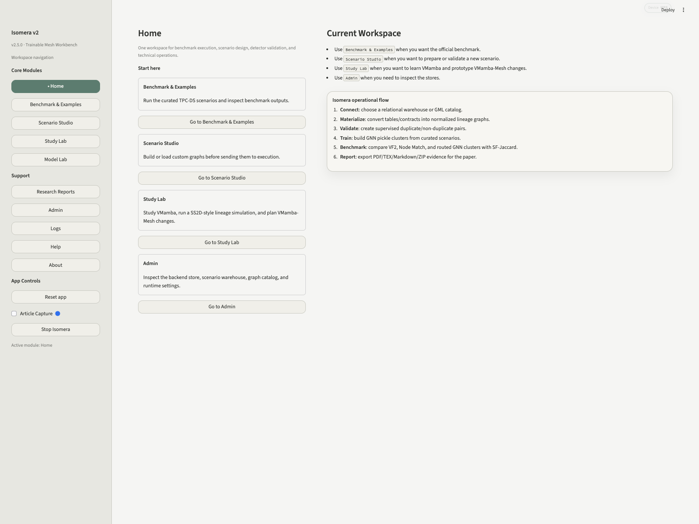
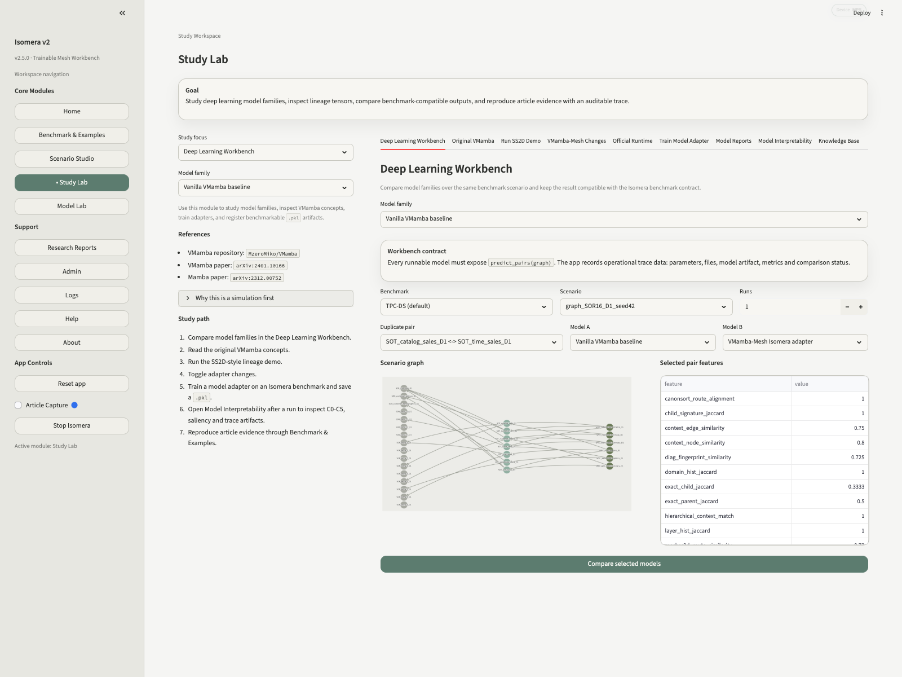
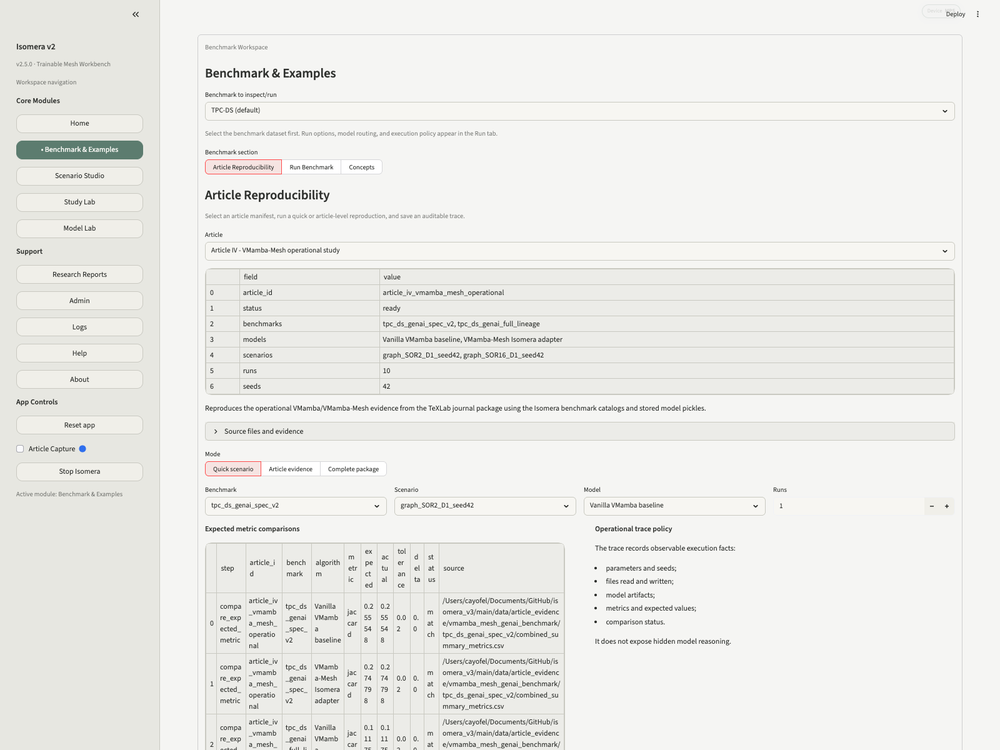

# Isomera v3

<p align="center">
  <strong>A reproducible workbench for finding duplicate tables from data lineage, graph evidence and trainable neural models.</strong>
</p>

<p align="center">
  <a href="https://www.python.org/"></a>
  <a href="https://streamlit.io/"></a>
  <a href="LICENSE"></a>
  <a href="https://www.modcs.org/"></a>
  <a href="https://www.linkedin.com/in/cayo-oliveira/"></a>
</p>

<p align="center">
  
</p>

## Why Isomera exists

In a real data platform, the same business table can appear more than once. One team creates a customer summary. Another team creates a similar customer summary for a different dashboard. A third team builds a sales aggregate that already exists somewhere else, but with another name, another transformation path or another semantic layer.

At first, this looks like a naming problem. In practice, it is a lineage problem. To decide whether two tables are duplicates, we need to know where they came from, which transformations produced them, which layer they belong to and how their neighborhoods compare inside the data architecture.

**Isomera** was built for that inspection. It turns tables and transformations into lineage graphs, compares candidate duplicate pairs with deterministic and neural models, shows the evidence behind the decision and stores enough metadata to reproduce the result later.

For a data engineer, the practical question is:

> "Can I take my lineage graph, run detectors over candidate table pairs, inspect why a pair was flagged, and reuse the model or the idea in my own environment?"

Isomera v3 is the public executable package for that workflow.

> [!TIP]
> **What makes Isomera useful quickly:** it runs several detector families in the same interface, including VF2, Node Match, GNN/GIN, Vanilla VMamba, VMamba-Mesh, VMamba-T and VMamba-Mesh-T. You can inspect packaged benchmarks, create new benchmark scenarios, validate duplicate-pair labels, register or route `.pkl` model artifacts, train supported model campaigns when dependencies are installed, and use optional LLM/OpenAI-assisted flows to help propose or review benchmark pairs when you provide an API key.

## The core idea

Isomera represents a data architecture as a directed graph. In the packaged benchmarks, nodes usually appear as:

- **SOR**, operational source or raw-system extract;
- **SOT**, transformation or trusted intermediate table;
- **SPEC**, semantic product or analytical table.

Edges represent dependency: one table was created from, joined with, filtered from or aggregated from another table. Once the architecture is represented as a graph, duplicate-table detection becomes a pair problem: given two candidate nodes or subgraphs, decide whether they represent the same structural or semantic object.

<p align="center">
  
</p>

This is where Isomera goes beyond a drawing tool. It can run exact graph baselines, graph neural baselines, deterministic VMamba-Mesh scoring and trainable PyTorch models over the same benchmark contract. The same pair can be inspected as a graph, as an adjacency matrix, as a six-channel tensor, as a model score and as an interpretability image.

## From graph to model evidence

The VMamba-Mesh representation converts each local lineage context into six channels:

| Channel | Meaning |
| --- | --- |
| C0 | forward adjacency, preserving original edge direction |
| C1 | reverse adjacency, allowing the model to read dependency in the opposite direction |
| C2 | layer diagonal, marking SOR, SOT and SPEC positions |
| C3 | degree fingerprint, exposing local connectivity and fan-in/fan-out |
| C4 | lineage-route bias, helping the scan follow meaningful data-flow routes |
| C5 | sparse mask, separating real graph cells from empty/padded cells |

<p align="center">
  
</p>

A deterministic model can use these channels to compute a structural score. A trainable model can read them through a neural pipeline inspired by VMamba and visual state-space models:

```text
graph pair
-> CanonSort
-> C0-C5 tensor channels
-> patch embedding
-> VSS/SS2D-style blocks
-> pooling
-> neural pair head
-> logit
-> sigmoid
-> duplicate score
-> threshold
-> duplicate / non-duplicate
```

<p align="center">
  
</p>

That means the output is not only a label. The app can show the score, the threshold, the model family, the device used, the benchmark scenario, the files generated and, when available, saliency maps showing which tensor regions affected the local decision.

## What you can do with Isomera

Isomera is organized as one Streamlit workspace. The main capabilities are:

<p align="center">
  
</p>

| Area | What it does |
| --- | --- |
| **Home** | Gives the starting point for benchmark execution, scenario design, model study and administration. |
| **Benchmark & Examples** | Runs curated benchmark datasets, compares algorithms, inspects scenarios, checks metrics and opens the Article Reproducibility flow. |
| **Scenario Studio** | Loads or creates custom graph scenarios, validates labels, inspects table pairs, trains model artifacts and publishes curated scenarios into the benchmark area. |
| **Study Lab** | Explains model families, VMamba/VMamba-Mesh concepts, tensor channels, deep-learning workflows, model reports and interpretability packages. |
| **Deep Learning Workbench** | Lets the user select benchmark, scenario, pair and model family, then compare model behavior with lightweight parameter changes. |
| **Model Reports** | Opens stored campaign reports, including deterministic adapters, VMamba-T, VMamba-Mesh-T, CPU/MPS comparisons and ablation evidence. |
| **Model Interpretability** | Loads a selected scenario/pair and renders graph, adjacency matrix, tensor channels, score, threshold, decision and saliency artifacts. |
| **Model Lab** | Lists available detectors and `.pkl` model artifacts, validates pickles and shows benchmark-to-model routing. |
| **Research Reports** | Opens generated CSV, JSON, Markdown, figures, manifests and reproduction packages from previous runs. |
| **Admin** | Shows backend status, scenario warehouse information, model artifacts, connection profiles and runtime settings. |
| **Logs** | Displays structured app and terminal logs for debugging and audit. |
| **Help** | Shows the VMamba-Mesh presentation and the technical documentation hub inside the app. |
| **About** | Documents version, authorship, research context and feature notes. |

<p align="center">
  
</p>

In short, Isomera can be used to:

- inspect lineage graphs and adjacency matrices;
- run duplicate-table detection benchmarks;
- compare VF2, Node Match, GNN/GIN, Vanilla VMamba, VMamba-Mesh, VMamba-T and VMamba-Mesh-T;
- validate and route stored `.pkl` model artifacts;
- train or inspect model campaigns when the required dependencies are available;
- open benchmark reports and reproducibility manifests;
- generate or inspect graph tensors and channel maps;
- inspect local interpretability through input-gradient saliency;
- compare quality metrics such as Jaccard and efficiency metrics such as SF-Jaccard;
- save outputs as CSV, JSON, Markdown, figures and manifests;
- use the packaged examples as a template for applying the same idea to a company lineage environment.

## Model families included

| Family | What it is useful for |
| --- | --- |
| **VF2** | Exact or near-exact graph matching. Good as an auditable deterministic baseline. |
| **Node Match** | Rule-based node and edge comparison. Useful when labels and local structure are reliable. |
| **GNN/GIN** | Graph neural pair classification artifacts. Useful for learned graph embeddings under imbalance. |
| **Vanilla VMamba** | Neural tensor route using adjacency channels C0/C1. Useful as the closer comparison to image-like VMamba input. |
| **VMamba-Mesh adapter** | Deterministic six-channel score. Fast and easy to audit. Useful as a first-pass operational detector. |
| **VMamba-T** | Trainable PyTorch model using C0/C1. Useful for testing whether neural learning helps beyond deterministic scoring. |
| **VMamba-Mesh-T** | Trainable PyTorch model using C0-C5. Useful for the full lineage-aware neural path with saliency support. |

The public package includes stored model artifacts and reports. A user can inspect the pickles, load the same benchmark routing and adapt the architecture for another lineage source.

## Applying the idea in another environment

A company does not need to copy the benchmark exactly. The important contract is simple:

1. Export lineage as a graph: tables are nodes, dependencies are directed edges.
2. Define candidate pairs: which tables should be compared.
3. Label a small set of known duplicate and non-duplicate pairs for validation or training.
4. Convert each pair context into an ordered matrix or C0-C5 tensor.
5. Run a deterministic detector, a stored pickle or a trainable model.
6. Review score, threshold, predicted label and interpretability artifacts.
7. Save the run manifest so the decision can be repeated later.

Inside this repository, the implementation points are:

```text
main/core/                             graph, benchmark, persistence and model logic
main/core/algorithms/                  detector implementations and model wrappers
main/data/architectures/               packaged benchmark graphs, labels and artifacts
main/data/research_reports/            stored campaign outputs surfaced by the UI
main/docs/tech_hub/                    technical documentation for adapting the system
```

If your environment already has lineage metadata from a catalog, orchestration tool or warehouse audit logs, the practical adaptation is to map that metadata into Isomera-style graph files and then reuse the model interface or the tensorization idea.

## Benchmarks packaged in the app

The repository includes curated benchmark families so a user can test the idea before adapting it to a company environment. `TPC-DS (default)` is the original executable benchmark family. `TPC-DS GenAI SPEC v2` focuses on semantic-product duplicates in the SPEC layer and was built with generated candidate pairs followed by validation. `TPC-DS GenAI Full Lineage` expands the comparison to SOR, SOT and SPEC nodes, which is harder because it mixes operational sources, transformations and semantic outputs.

Inside `Benchmark & Examples`, the user can select a benchmark, inspect scenarios, run detector families, compare metrics, open article-style reproducibility manifests and save auditable outputs. When an OpenAI key is configured, LLM-assisted workflows can help propose or review candidate benchmark pairs; Isomera still keeps the graph, labels, metrics and manifests as the auditable layer.

<p align="center">
  
</p>

## What you can reproduce

The public repository packages evidence for the final VMamba-Mesh study:

- benchmark scenarios for SPEC v2 and Full Lineage;
- deterministic and trainable model reports;
- stored model artifacts and manifests;
- score, threshold and decision traces;
- tensor-channel visualizations;
- input-gradient saliency for the SOR16-D1 example;
- CSV, JSON and Markdown outputs generated by the reproducibility flow.

<p align="center">
  
  
</p>

Jaccard measures quality over predicted duplicate pairs. SF-Jaccard combines correct duplicate identification with runtime, so it is useful when the operational question is not only "which model is more accurate?" but also "which model can scan more candidates per second?".

## Quick start

```bash
git clone https://github.com/cayo-oliveira/isomera_v3.git
cd isomera_v3
python3.11 -m venv .venv
.venv/bin/python -m pip install --upgrade pip
.venv/bin/python -m pip install -r main/requirements.txt
.venv/bin/python -m streamlit run main/ui/app.py --server.port 8501 --server.address localhost
```

Open:

```text
http://localhost:8501
```

On macOS, you can also use:

```bash
./launch_isomera.command
```

The launcher checks the virtual environment, dependencies, Streamlit process state and local database services before opening the app.

## Suggested first walkthrough

After opening the app:

1. Go to `Help -> VMamba-Mesh Presentation` for the problem, architecture and result story.
2. Go to `Study Lab -> Deep Learning Workbench` and select `tpc_ds_genai_spec_v2`.
3. Inspect `graph_SOR16_D1_seed42`.
4. Compare `Vanilla VMamba baseline` and `VMamba-Mesh Isomera adapter`.
5. Open `Study Lab -> Model Reports` and inspect stored VMamba-T / VMamba-Mesh-T campaigns.
6. Open `Study Lab -> Model Interpretability`, select the SOR16-D1 pair and inspect graph, matrix, C0-C5 channels, score, threshold and saliency.
7. Open `Benchmark & Examples -> Article Reproducibility` and run the packaged reproduction flow.
8. Open `Research Reports` to inspect saved outputs.

<p align="center">
  
</p>

## Repository map

```text
main/ui/app.py                         Streamlit app entry point
main/core/                             Graph, benchmark, model and persistence logic
main/core/algorithms/                  VF2, Node Match, GNN, VMamba and VMamba-Mesh routes
main/scripts/                          Launch and reproducibility helpers
main/data/architectures/               Packaged benchmarks, labels and model artifacts
main/data/tpcds_postgres/              PostgreSQL scenario manifests and schema files
main/data/article_evidence/            Packaged reproducibility evidence used by the app
main/data/research_reports/            Stored reports surfaced in the UI
main/docs/                             Public technical documentation and presentation assets
.github/knowledge_bases/               Knowledge base files shown in Study Lab help
```

This public repository intentionally excludes the private research workspace, notebooks, manuscript work directories, local virtual environments, runtime logs and caches. The goal is to keep the package runnable, reviewable and easier to reuse.

## Requirements

Recommended:

- macOS or Linux;
- Python 3.11+;
- Git;
- internet access for the first dependency installation.

Optional:

- PostgreSQL 16 for materialized TPC-DS inspection;
- MySQL for backend demonstrations;
- Apple Silicon MPS or another PyTorch-supported device for neural experiments.

Packaged benchmarks can be inspected without manually creating databases first. Database-backed flows require local database services.

## Research context

Isomera v3 was developed in the context of graduate research at the **Centro de Informatica da Universidade Federal de Pernambuco (CIn/UFPE)** and the **[MoDCS Research Group](https://www.modcs.org/)**.

The MoDCS public site presents the group as a CIn/UFPE research group with projects, publications, theses, dissertations, courses and WMoDCS activities. In this repository, MoDCS is the research context for the data-lineage, governance and reproducible-modeling work packaged in Isomera.

**Authors and contacts**

- **Cayo Oliveira**, developer and graduate researcher, CIn/UFPE.  
  Email: [cflo@cin.ufpe.br](mailto:cflo@cin.ufpe.br), [cayo07@gmail.com](mailto:cayo07@gmail.com).  
  LinkedIn: [cayo-oliveira](https://www.linkedin.com/in/cayo-oliveira/).
- **Prof. Jamilson Dantas**, advisor, CIn/UFPE.  
  Email: [jrd@cin.ufpe.br](mailto:jrd@cin.ufpe.br).
- **MoDCS Research Group**, CIn/UFPE: <https://www.modcs.org/>.

## Citation

If you use this software in academic work, cite Isomera, Cayo Oliveira, Prof. Jamilson Dantas, CIn/UFPE and the associated MoDCS/CIn-UFPE research artifacts on data lineage, duplicate-table detection and VMamba-Mesh reproducibility.

A formal citation file can be added after final publication metadata is available.

## License

Released under the MIT License. See [LICENSE](LICENSE) and [NOTICE](NOTICE).
