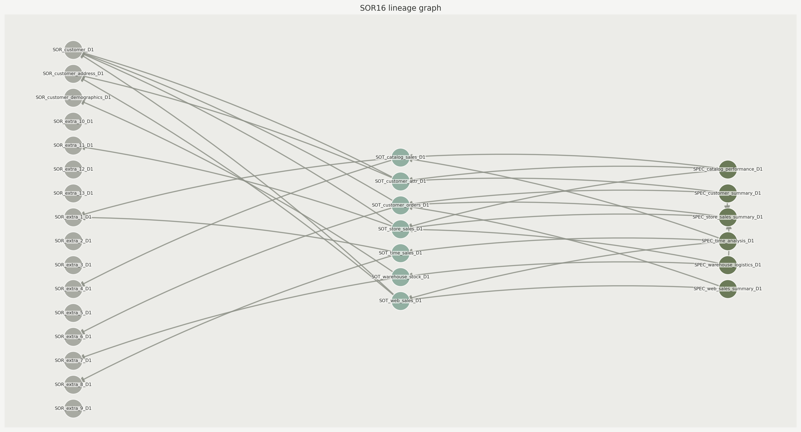
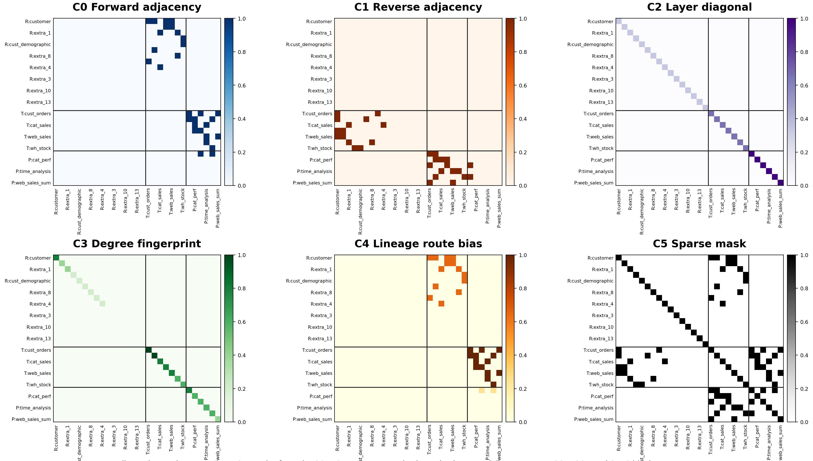
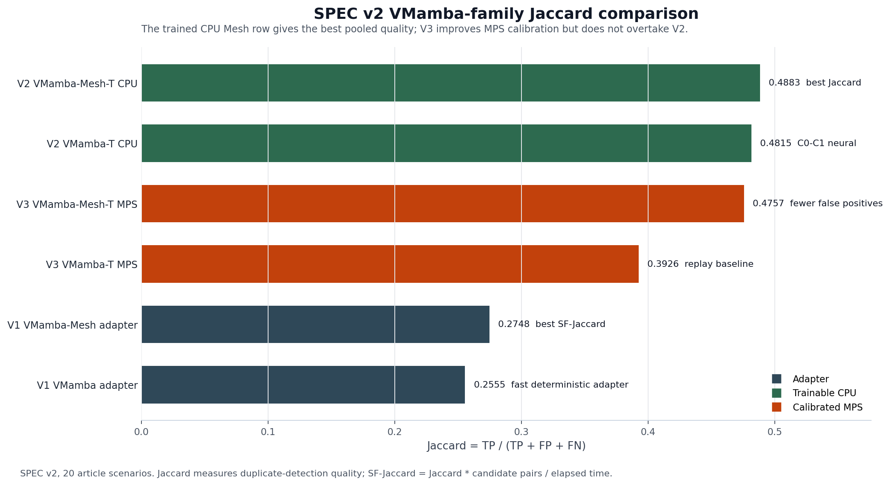
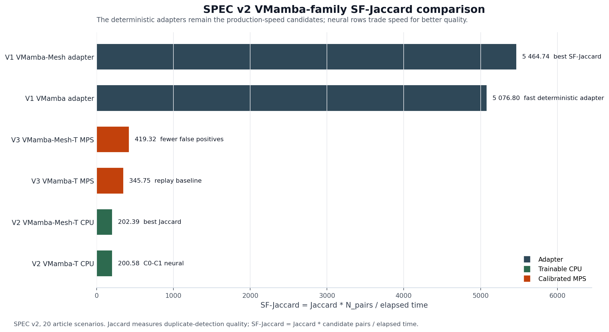
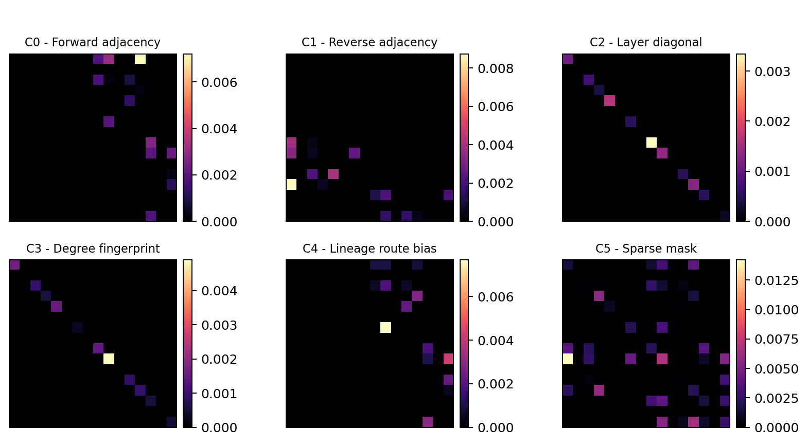

# Isomera v3

<p align="center">
  <strong>Find duplicate tables in data architectures by turning lineage into reproducible graph, tensor and neural evidence.</strong>
</p>

<p align="center">
  <a href="https://www.python.org/"></a>
  <a href="https://streamlit.io/"></a>
  <a href="LICENSE"></a>
  <a href="https://www.modcs.org/"></a>
</p>

<p align="center">
  
</p>

## The short version

Modern data platforms often contain the same analytical idea more than once: two domains recreate a customer summary, a sales aggregate, a reporting table or a semantic product with different names and slightly different lineage. Exact graph isomorphism catches only part of this. A useful governance tool needs to inspect lineage, compare candidate pairs, explain the decision and reproduce the result later.

**Isomera v3** is the executable version of that workflow. It packages benchmark lineage graphs, deterministic graph baselines, trainable deep-learning models, model reports, interpretability artifacts and a Streamlit interface that lets a reviewer move from a table-pair suspicion to auditable evidence.

## What Isomera does

Isomera reads data-architecture scenarios as directed lineage graphs. Nodes represent operational sources, transformations and semantic products. Candidate duplicate tables are evaluated through several model families under the same app contract: each model receives graph evidence and returns duplicate-pair decisions, scores, metrics and reproducibility traces.

The VMamba-Mesh path converts a local graph context into a six-channel tensor:

<p align="center">
  
  
</p>

<p align="center">
  
</p>

The channels are: forward adjacency, reverse adjacency, layer diagonal, degree fingerprint, lineage-route bias and sparse mask. This makes the tensor more than an image of a graph: it preserves direction, layer, sparsity and governance structure before scoring or neural inference.

## Model families included

Isomera v3 includes executable routes for:

| Family | Role in the app |
| --- | --- |
| VF2 | deterministic exact/near-exact graph matching baseline |
| Node Match | deterministic node/edge matching baseline |
| GNN/GIN | graph neural pair-classifier artifacts |
| Vanilla VMamba | trainable tensor route using adjacency channels C0/C1 |
| VMamba-Mesh adapter | deterministic six-channel structural score |
| VMamba-T | PyTorch trainable model over C0/C1 |
| VMamba-Mesh-T | PyTorch trainable model over the full C0-C5 tensor |

For the trainable route, the decision path is:

```text
graph pair
-> CanonSort
-> tensor channels
-> patch embedding
-> VSS/SS2D-style blocks
-> pooling
-> neural pair head
-> logit
-> sigmoid
-> threshold
-> duplicate / non-duplicate
```

<p align="center">
  
</p>

## What you can reproduce

The public repository is designed so a professor, reviewer or researcher can run the app and inspect the same kind of evidence used in the final report:

- benchmark scenarios for SPEC v2 and Full Lineage;
- stored model artifacts and manifests;
- deterministic and trainable model reports;
- score, threshold and decision traces;
- tensor-channel visualizations;
- input-gradient saliency for a selected SOR16-D1 pair;
- CSV, JSON and Markdown reports generated by the reproducibility workflow.

<p align="center">
  
  
</p>

## Quick start

```bash
git clone https://github.com/cayo-oliveira/isomera_v3.git
cd isomera_v3
python3.11 -m venv .venv
.venv/bin/python -m pip install --upgrade pip
.venv/bin/python -m pip install -r main/requirements.txt
.venv/bin/python -m streamlit run main/ui/app.py --server.port 8501 --server.address localhost
```

Open:

```text
http://localhost:8501
```

On macOS, you can also use:

```bash
./launch_isomera.command
```

The launcher checks the virtual environment, dependencies, Streamlit process state and local database services before opening the app.

## Recommended demo path

Inside the app, follow this path for a compact review:

```text
Help -> VMamba-Mesh Presentation
Study Lab -> Deep Learning Workbench
Study Lab -> Model Reports
Study Lab -> Model Interpretability
Benchmark & Examples -> Article Reproducibility
Research Reports
```

A practical first walkthrough:

1. Open `Help -> VMamba-Mesh Presentation` to see the problem, architecture and result story.
2. Open `Study Lab -> Deep Learning Workbench`, select `tpc_ds_genai_spec_v2` and inspect `graph_SOR16_D1_seed42`.
3. Compare `Vanilla VMamba baseline` with `VMamba-Mesh Isomera adapter`.
4. Open `Study Lab -> Model Reports` to inspect stored VMamba-T and VMamba-Mesh-T campaigns.
5. Open `Study Lab -> Model Interpretability` to load SOR16-D1, inspect graph, matrix, channels, score, threshold and saliency.
6. Open `Benchmark & Examples -> Article Reproducibility` to run the packaged reproducibility workflow.

<p align="center">
  
</p>

## Repository map

```text
main/ui/app.py                         Streamlit app entry point
main/core/                             Graph, benchmark, model and persistence logic
main/core/algorithms/                  VF2, Node Match, GNN, VMamba and VMamba-Mesh routes
main/scripts/                          Launch and reproducibility helpers
main/data/architectures/               Packaged benchmarks, labels and model artifacts
main/data/tpcds_postgres/              PostgreSQL scenario manifests and schema files
main/data/article_evidence/            Packaged reproducibility evidence used by the app
main/data/research_reports/            Stored reports surfaced in the UI
main/docs/                             Public technical documentation and presentation assets
.github/knowledge_bases/               Knowledge base files shown in Study Lab help
```

This repository intentionally excludes the private research workspace, notebooks, manuscript work directories, local virtual environments, runtime logs and caches. The goal is to keep the public package runnable and reviewable.

## Requirements

Recommended:

- macOS or Linux;
- Python 3.11+;
- Git;
- internet access for the first dependency installation.

Optional:

- PostgreSQL 16 for materialized TPC-DS inspection;
- MySQL for backend demonstrations;
- Apple Silicon MPS or another PyTorch-supported device for neural experiments.

Packaged benchmarks can be inspected without manually creating databases first. Database-backed flows require local database services.

## Research context

Isomera v3 was developed in the context of graduate research at the **Centro de Informatica da Universidade Federal de Pernambuco (CIn/UFPE)** and the **[MoDCS Research Group](https://www.modcs.org/)**.

The MoDCS public site presents the group as a CIn/UFPE research group with projects, publications, theses, dissertations, courses and WMoDCS activities. In this repository, MoDCS is the research context for the data-lineage, governance and reproducible-modeling work packaged in Isomera.

**Authors and contacts**

- **Cayo Oliveira**, developer and graduate researcher, CIn/UFPE.  
  Email: [cflo@cin.ufpe.br](mailto:cflo@cin.ufpe.br), [cayo07@gmail.com](mailto:cayo07@gmail.com).  
  LinkedIn: [cayo-oliveira](https://www.linkedin.com/in/cayo-oliveira/).
- **Prof. Jamilson Dantas**, advisor, CIn/UFPE.
- **MoDCS Research Group**, CIn/UFPE: <https://www.modcs.org/>.

## Citation

If you use this software in academic work, cite Isomera, Cayo Oliveira, Prof. Jamilson Dantas, CIn/UFPE and the associated MoDCS/CIn-UFPE research artifacts on data lineage, duplicate-table detection and VMamba-Mesh reproducibility.

A formal citation file can be added after final publication metadata is available.

## License

Released under the MIT License. See [LICENSE](LICENSE) and [NOTICE](NOTICE).
