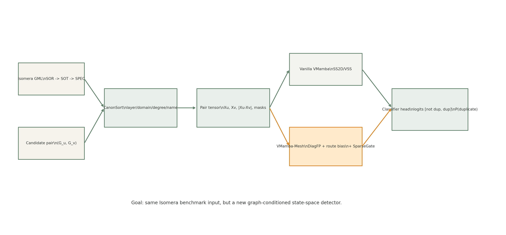
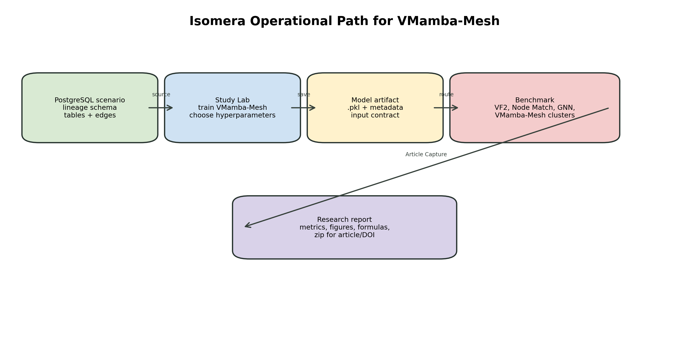
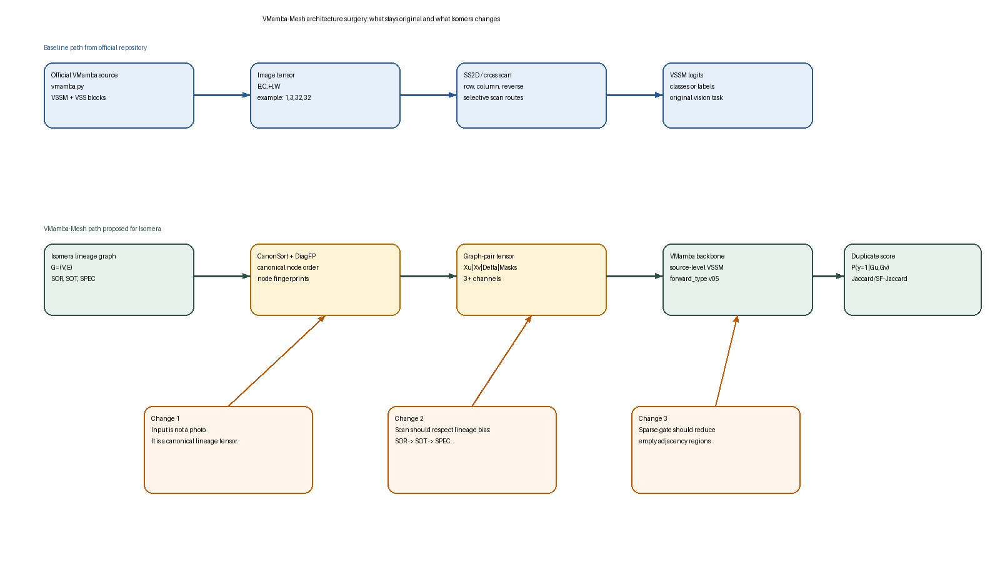
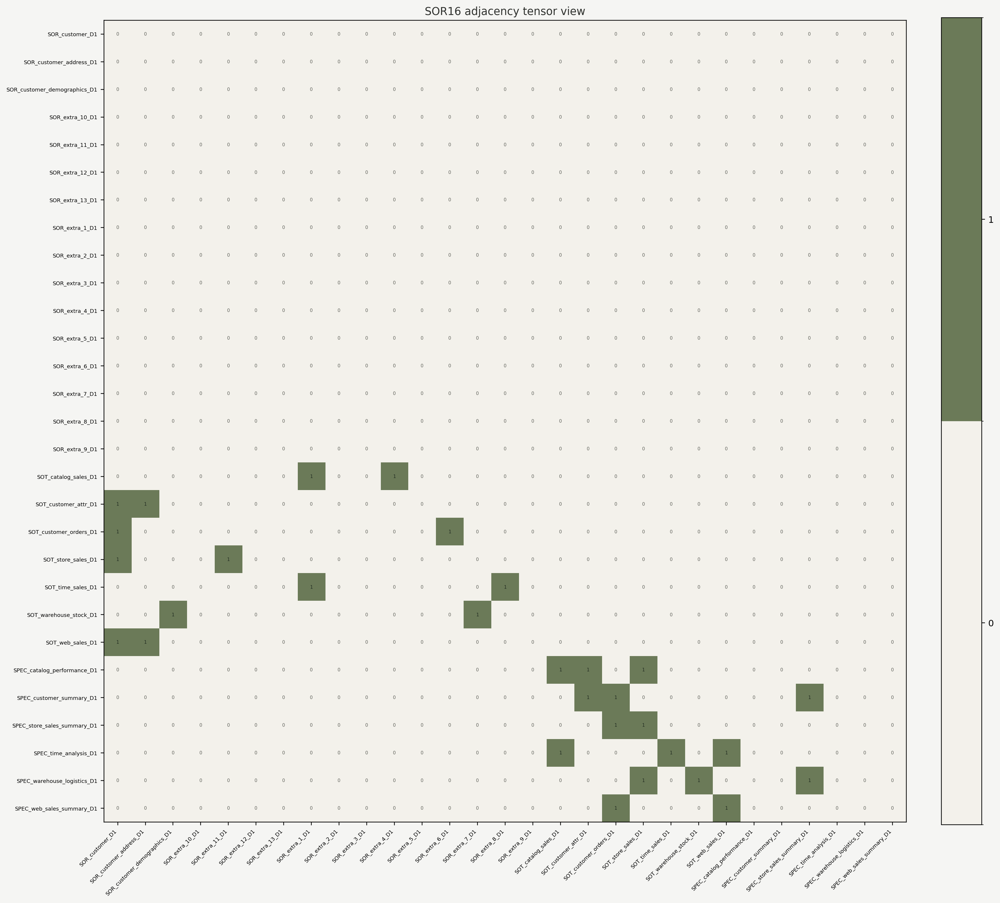
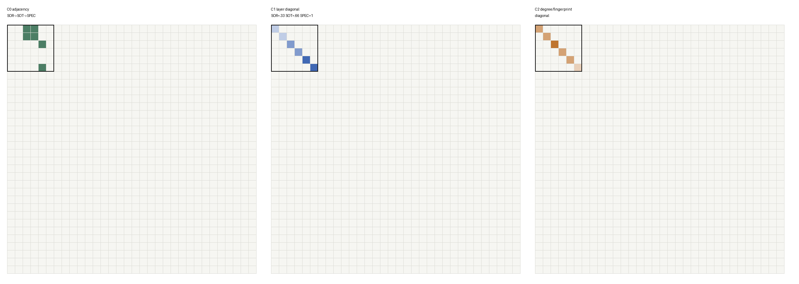
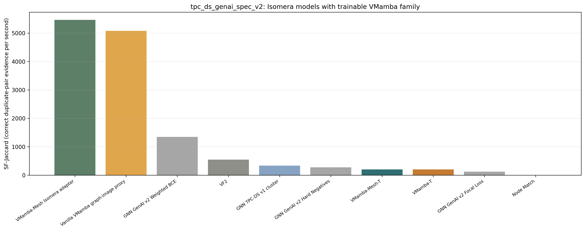
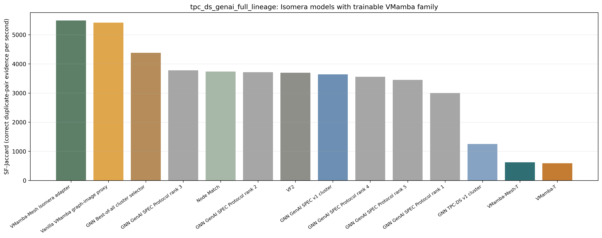

# Isomera v3

**A reproducible workbench for finding duplicate tables in data architectures using lineage graphs, graph matching and trainable neural models.**

Isomera v3 turns a data architecture into something that can be inspected, tested and reproduced. Instead of asking only whether two table names look similar, Isomera looks at lineage: where a table comes from, which transformations created it, which semantic layer it belongs to and how similar its neighborhood is to another table.

<p align="center">
  
</p>

## Why This Exists

Data Mesh decentralizes ownership. That is useful, but it also makes it easier for different domains to recreate equivalent tables with different names, slightly different transformations or different local conventions. The result is duplicated maintenance, repeated storage, inconsistent metrics and harder governance.

Isomera was created to make this problem operational. It represents SOR, SOT and SPEC assets as lineage graphs, compares candidate table pairs with deterministic and neural models, and records the evidence needed to reproduce each result.

<p align="center">
  
</p>

## What Is Isomera?

Isomera is a local Streamlit application and research workbench. It lets a user:

- inspect benchmark lineage graphs;
- compare duplicate-table detectors side by side;
- run VF2, Node Match, GNN/GIN, Vanilla VMamba, VMamba-Mesh, VMamba-T and VMamba-Mesh-T;
- open stored reports and model artifacts;
- inspect neural/structural interpretability images;
- reproduce Article IV evidence from packaged benchmarks, metrics and manifests.

The core idea is simple: a data lineage graph can be converted into a canonical tensor. That tensor can be read by graph algorithms, deterministic VMamba-Mesh adapters or trainable PyTorch models inspired by visual state-space models.

<p align="center">
  
</p>

## Research Context

This public repository is the executable release of Isomera v3. It was developed in the context of graduate research at **Centro de Informática da Universidade Federal de Pernambuco (CIn/UFPE)**, in connection with the **[MoDCS Research Group](https://www.modcs.org/)**.

The MoDCS public website identifies the group as **MoDCS Research Group** and organizes its academic material around research projects, publications, theses/dissertations, courses and WMoDCS activities. In this repository, MoDCS is referenced as the CIn/UFPE research group context in which this line of work is being developed.

**Authors and contacts**

- **Cayo Oliveira** — developer and graduate researcher, CIn/UFPE.  
  Email: [cflo@cin.ufpe.br](mailto:cflo@cin.ufpe.br), [cayo07@gmail.com](mailto:cayo07@gmail.com).  
  LinkedIn: [cayo-oliveira](https://www.linkedin.com/in/cayo-oliveira/).
- **Prof. Jamilson Dantas** — advisor, CIn/UFPE.
- **MoDCS Research Group** — CIn/UFPE research group context: <https://www.modcs.org/>.

## What Is Included

```text
main/ui/app.py                         Streamlit application entry point
main/core/                             Core graph, benchmark, model and persistence logic
main/core/algorithms/                  VF2, Node Match, GNN, VMamba, VMamba-Mesh and trainable VMamba models
main/scripts/                          Local launcher and reproducibility helpers
main/data/architectures/               Benchmark graphs, labels and stored model artifacts
main/data/tpcds_postgres/              PostgreSQL scenario manifests and schema files
main/data/article_evidence/            Packaged Article IV evidence used by the app
main/data/research_reports/            Reproducibility reports and result packages used by the UI
main/docs/presentations/               Runtime images and presentation assets shown inside the app
.github/knowledge_bases/               Knowledge base files shown in the Study Lab help
```

This repository intentionally excludes the private research workspace:

```text
research/
papercept_compiler/
Jupyter notebooks
LaTeX manuscript workspaces
local virtual environments
runtime logs and caches
```

## Quick Start

Recommended manual startup:

```bash
git clone https://github.com/cayo-oliveira/isomera_v3.git
cd isomera_v3
python3.11 -m venv .venv
.venv/bin/python -m pip install --upgrade pip
.venv/bin/python -m pip install -r main/requirements.txt
.venv/bin/python -m streamlit run main/ui/app.py --server.port 8501 --server.address localhost
```

Then open:

```text
http://localhost:8501
```

On macOS, the launcher can also be used:

```bash
./launch_isomera.command
```

The launcher checks the local virtual environment, dependencies, Streamlit process state and local database services before opening the app.

## Requirements

Recommended environment:

- macOS or Linux;
- Python 3.11+;
- Git;
- internet access for the first dependency installation.

Optional but useful:

- PostgreSQL 16, for materialized TPC-DS scenario inspection;
- MySQL, for publication/backend demonstrations;
- Apple Silicon MPS or another PyTorch-supported device for neural experiments.

The app can open and inspect packaged benchmarks without manually creating the databases first. Database-backed flows require local database services.

## First Walkthrough

After opening the app, these are the most useful paths:

```text
Help -> VMamba-Mesh Presentation
Study Lab -> Deep Learning Workbench
Study Lab -> Model Reports
Study Lab -> Model Interpretability
Benchmark & Examples -> Article Reproducibility
Research Reports
```

A good first run is:

1. Open `Help -> VMamba-Mesh Presentation` to understand the problem and architecture.
2. Open `Study Lab -> Deep Learning Workbench` and select `tpc_ds_genai_spec_v2`.
3. Compare `Vanilla VMamba baseline` and `VMamba-Mesh Isomera adapter`.
4. Open `Study Lab -> Model Reports` to inspect trainable VMamba-T and VMamba-Mesh-T evidence.
5. Open `Study Lab -> Model Interpretability` and inspect saliency/structural influence for SOR16-D1.
6. Open `Benchmark & Examples -> Article Reproducibility` and run the Article IV reproduction flow.

<p align="center">
  
  
</p>

## Model Families

The public package includes executable model families used by the app:

- **VF2**: deterministic graph-isomorphism baseline.
- **Node Match**: deterministic baseline using graph/node matching rules.
- **GNN/GIN**: graph neural pair-classifier artifacts.
- **Vanilla VMamba baseline**: tensor-based baseline using graph-derived channels.
- **VMamba-Mesh adapter**: deterministic lineage-aware VMamba-Mesh scoring path.
- **VMamba-T**: trainable PyTorch model using C0/C1 channels.
- **VMamba-Mesh-T**: trainable PyTorch model using the full C0-C5 tensor contract.

The trainable path follows this contract:

```text
graph pair
-> CanonSort
-> tensor channels
-> patch embedding
-> VSS/SS2D-style blocks
-> pooling
-> neural pair head
-> logit
-> sigmoid
-> threshold
-> duplicate / non-duplicate
```

<p align="center">
  
</p>

## Reproducing The Article IV Evidence

The packaged Article IV evidence is available under:

```text
main/data/article_evidence/vmamba_mesh_genai_benchmark/
```

The benchmark/model artifacts are available under:

```text
main/data/architectures/tpc_ds_genai_spec_v2/
main/data/architectures/tpc_ds_genai_full_lineage/
```

Inside the app:

```text
Benchmark & Examples -> Article Reproducibility
```

Select:

```text
Article IV - VMamba-Mesh operational study
```

Use quick mode for a single scenario or article evidence mode to compare stored metrics against expected article values.

<p align="center">
  
  
</p>

## Repository Scope

This repository is meant to be runnable and public. It is not the complete private research workspace. Generated manuscripts, notebooks and TeXLab materials should remain outside this repository unless explicitly prepared for publication.

The first public goal is reproducibility: a professor, reviewer or researcher should be able to clone the repository, install dependencies, open the app and inspect the same benchmark/model evidence used in the demo.

## Citation

If you use this software in academic work, cite the Isomera project, Cayo Oliveira, Prof. Jamilson Dantas, CIn/UFPE and the related MoDCS/CIn-UFPE research artifacts associated with data lineage, duplicate table detection and VMamba-Mesh reproducibility.

A formal citation file may be added after the final publication metadata is available.

## License

This repository is released under the MIT License. See [LICENSE](LICENSE) and [NOTICE](NOTICE).
