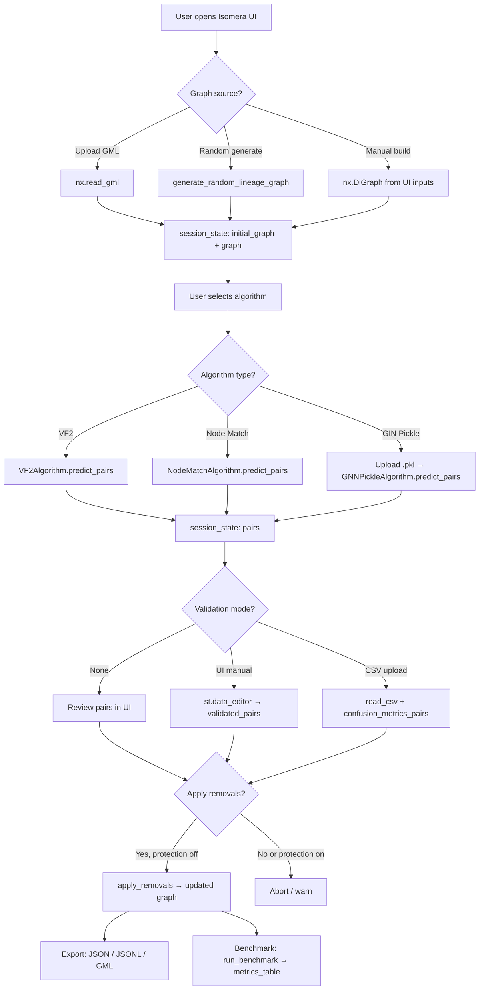

# 08 — Graph Maps and Relationship Diagrams

> **Navigation:** [README](README.md) | [01 What Is Isomera](01_What_Is_Isomera.md) | [02 Data Flow](02_Data_Flow_and_State.md) | [03 UI Tabs](03_UI_Tabs_Guide.md) | [04 Core Modules](04_Core_Modules.md) | [05 Algorithms](05_Algorithms_and_Models.md) | [06 Libraries](06_Libraries_and_Stack.md) | [07 Pseudocode](07_Pseudocode_Reference.md)

---

This file contains diagrams of the key relationships and topologies in Isomera: the module dependency graph, the data flow graph, the algorithm call graph, and example lineage graph structures.

---

## Map 1: Module Dependency Graph

```
app/main.py (Streamlit entry)
│
├── ui/app.py (UI orchestrator)
│   ├── Tab 1: Upload / View
│   ├── Tab 2: Build
│   ├── Tab 3: Generate
│   ├── Tab 4: Benchmark
│   ├── Tab 5: Detect (calls isomorphism.py)
│   ├── Tab 6: Validate (calls metrics.py)
│   ├── Tab 7: Remove (calls isomorphism.py)
│   └── Tab 8: Export / CSV Validation
│
├── core/isomorphism.py
│   ├── find_isomorphic_pairs(G, algorithm) → list[tuple]
│   │   └── algorithm.predict_pairs(G)
│   └── apply_removals(G, pairs) → DiGraph
│
├── core/metrics.py
│   ├── confusion_metrics_pairs(predicted, ground_truth)
│   ├── metrics_table(result_list)
│   └── execution_times(algorithm, G, runs) → list[float]
│
├── core/lineage.py
│   └── generate_random_lineage_graph(sor, domains, seed) → DiGraph
│
├── core/database.py
│   └── SessionLogger (SQLAlchemy + JSONL)
│
└── core/algorithms/
    ├── __init__.py (get_algorithm_by_name registry)
    ├── vf2.py (VF2Algorithm)
    ├── node_match.py (NodeMatchAlgorithm)
    ├── gnn_pickle.py (GNNPickleAlgorithm)
    └── gnn_model.py (GINLayer, SubgraphGNN, PairClassifier)
```

---

## Map 2: Session State Flow

```
User Action
    │
    ▼
st.session_state mutation
    │
    ├── "initial_graph"     (set once on load; never mutated)
    ├── "graph"             (mutable working copy; updated by removals)
    ├── "pairs"             (output of predict_pairs; replaced on re-run)
    ├── "removed_pairs"     (pairs passed to apply_removals)
    ├── "algorithm_name"    (selected algorithm label)
    ├── "pkl_path"          (path to uploaded .pkl for GIN)
    ├── "gt_pairs"          (ground truth pairs from CSV upload)
    ├── "validated_df"      (editable DataFrame from st.data_editor)
    ├── "metrics"           (last confusion metrics dict)
    ├── "benchmark_results" (list of per-run result dicts)
    └── "protection_active" (bool — blocks apply_removals)
    │
    ▼
st.rerun() → full script re-execution → UI updated
```

---

## Map 3: Lineage Graph Topology (Example: SOR=4, D=2)

```
Domain 1                    Domain 2
───────────────────         ───────────────────
D1_SOR1  D1_SOR2            D2_SOR1  D2_SOR2
D1_SOR3  D1_SOR4            D2_SOR3  D2_SOR4
   │  │    │  │                │  │    │  │
   ▼  ▼    ▼  ▼                ▼  ▼    ▼  ▼
D1_SOT1  D1_SOT2            D2_SOT1  D2_SOT2
D1_SOT3  D1_SOT4            D2_SOT3  D2_SOT4
   │  │    │  │                │  │    │  │
   ▼  ▼    ▼  ▼                ▼  ▼    ▼  ▼
 D1_SPEC1  D1_SPEC2          D2_SPEC1  D2_SPEC2
```

**Properties of this graph:**
- Nodes: `(4+4+2) × 2 = 20` nodes total.
- Edges: `n_domains × (sor fanin edges to SOT + SOT fanin edges to SPEC)` (variable; random).
- Layers: SOR → SOT → SPEC (strictly left-to-right, no cycles).
- Redundancy structure: nodes with the same local subgraph topology across domains are the redundant pairs.

**Why SOR=16 is harder:** With 16 SOR nodes per domain, local subgraphs at SOT level can have many different fan-in patterns. VF2/NodeMatch become more effective at distinguishing structural differences. GIN's learned embedding captures recurring structural motifs more robustly.

---

## Map 4: Algorithm Call Graph

```
predict_pairs(G)
│
├── VF2Algorithm
│   └── for i,j: nx.is_isomorphic(subgraph_i, subgraph_j)
│
├── NodeMatchAlgorithm
│   └── for i,j: nx.is_isomorphic(subgraph_i, subgraph_j,
│                                   node_match=λ x,y→x==y)
│
└── GNNPickleAlgorithm
    ├── load_pickle(pkl_path)
    │   └── FallbackUnpickler → (SubgraphGNN, PairClassifier)
    ├── for v in G: gnn(to_pyg_data(subgraph_v)) → h_v
    └── for (u,v): sigmoid(clf(h_u, h_v)) ≥ 0.3 → pair
```

---

## Map 5: GIN Neural Architecture Graph

The article-ready version of this map is generated as a high-resolution image:


Use this image when explaining how the graph seen in Scenario Studio becomes model input:

- The visible lineage graph is the same graph used by the model.
- Each table is a node.
- Each lineage dependency is a directed edge.
- Each reviewed pair is converted into two local upstream subgraphs.
- `x = ones(|V|, 1)` is the current structural-only node feature matrix.
- `edge_index` is the directed adjacency consumed by the GIN layers.
- The model outputs a logit; sigmoid plus threshold produces the duplicate decision.

```
Input: nx subgraph S_v
         │
         ▼
  to_pyg_data(S_v)
  ┌────────────────────────────────────┐
  │ x: ones(|V|, 1) — constant feature│
  │ edge_index: [2, |E|] — adjacency   │
  │ batch: zeros(|V|) — graph index    │
  └────────────────────────────────────┘
         │
         ▼
  GINLayer(1 → 64)
  ┌───────────────────────────────────────────────────────────┐
  │ agg ← Σ_{u∈N(v)} h_u   (sum aggregation)                 │
  │ out ← MLP((1+ε)·h_v + agg)                               │
  │ MLP: Linear(1→64) → ReLU → Linear(64→64)                 │
  └───────────────────────────────────────────────────────────┘
         │
         ▼
       ReLU
         │
         ▼
  GINLayer(64 → 64)
  ┌───────────────────────────────────────────────────────────┐
  │ agg ← Σ_{u∈N(v)} h_u                                     │
  │ out ← MLP((1+ε)·h_v + agg)                               │
  │ MLP: Linear(64→64) → ReLU → Linear(64→64)                │
  └───────────────────────────────────────────────────────────┘
         │
         ▼
  global_mean_pool(h, batch)
         │
         ▼
  h_G ∈ ℝ^64   (graph-level embedding)

────────────────────────────────────────────────
For pair (u, v):

  h_{S_u} ∈ ℝ^64         h_{S_v} ∈ ℝ^64
       │                        │
       └──────────┬─────────────┘
                  ▼
       concat([h_{S_u}, h_{S_v}]) ∈ ℝ^128
                  │
                  ▼
        PairClassifier
        ┌────────────────────────────────────┐
        │ Linear(128 → 128) → ReLU → Linear(128 → 1) │
        └────────────────────────────────────┘
                  │
                  ▼
            logit z_{uv}
                  │
                  ▼
          σ(z_{uv}) = p_{uv}
                  │
           p ≥ 0.3 → pair
```

---

## Map 6: Benchmark Execution Flow

```
BENCHMARK_PIPELINE
│
├── for each SOR ∈ {2, 4, 8, 16}:
│   ├── for each domain_count ∈ {1, 2, 3, 4, 5}:
│   │   ├── G ← generate_random_lineage_graph(sor, domain_count, seed=42)
│   │   ├── GT ← known_redundant_pairs(G)
│   │   ├── all_possible ← C(|V|, 2)
│   │   │
│   │   └── for each algorithm ∈ [VF2, NodeMatch, GIN]:
│   │       ├── predicted ← algorithm.predict_pairs(G)  (once)
│   │       ├── times ← [perf_counter(algorithm, G) × 25 runs]
│   │       ├── ET ← mean(times)
│   │       ├── ACC ← (TP+TN)/|all_possible|
│   │       └── SF ← (ACC × |all_possible|) / ET
│   │
│   └── aggregate across domain counts → mean ± std per algorithm
│
└── VISUALIZE(results)
    ├── Bar: ACC per algorithm per SOR
    ├── Bar: ET per algorithm per SOR
    └── Scatter: SF vs SOR
```

---

## Map 7: Artifact Relationships

```
Workspace root
│
├── gml_package/
│   ├── graph_SOR{2,4,8,16}_D{1..5}_seed42.gml   ← benchmark scenarios
│   └── random_lineage_*.gml                       ← user-generated scenarios
│
├── logs/
│   └── session_*.jsonl                            ← JSONL event logs
│       └── {timestamp, event, graph_id, pairs, metrics, ...}
│
├── data/
│   ├── graphs/                                    ← stored graphs (session saves)
│   └── architectures/                             ← saved algorithm configs
│
└── docs/tech_hub/
    ├── 01_What_Is_Isomera.md
    ├── 02_Data_Flow_and_State.md
    ├── 03_UI_Tabs_Guide.md
    ├── 04_Core_Modules.md
    ├── 05_Algorithms_and_Models.md
    ├── 06_Libraries_and_Stack.md
    ├── 07_Pseudocode_Reference.md
    └── 08_Graph_Maps.md  ← (this file)
```

---

## Map 8: End-to-End Mermaid Flowchart


