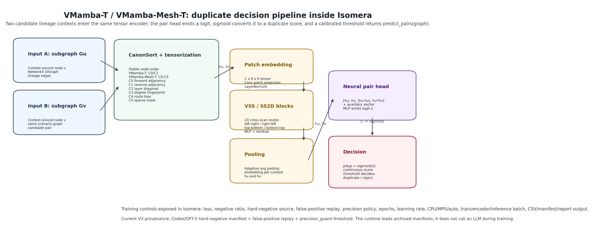
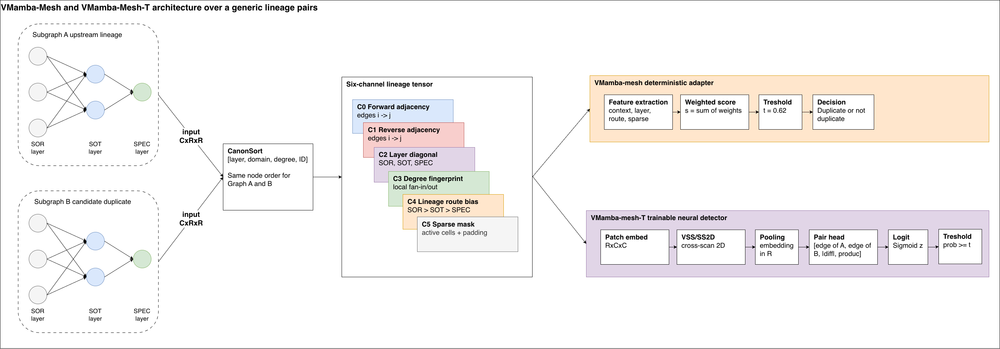

# 10 — Isomera Protocol and Article Workflow

> **Navigation:** [README](README.md) | [09 Scenario Materialization API](09_Scenario_Materialization_API.md)

This guide explains how to use Isomera v2 without wasting long training runs and how to collect article-ready evidence.

## Recommended Workflow

Use this order when the goal is to produce a reproducible benchmark or paper section:

1. Open Isomera with `launch_isomera.command`.
2. Enable `Article Capture` in the sidebar.
3. Go to `Scenario Studio`.
4. Choose the source:
   - `Scenario Warehouse` for PostgreSQL scenarios.
   - `GML Catalog` for existing portable graph files.
   - manual builder only for small custom architectures.
5. Load one scenario.
6. Inspect source metadata, lineage graph, edge table, and adjacency matrix.
7. Choose candidate filters.
8. Review pairs and create the supervised validation dataset.
9. Publish the curated scenario into a benchmark.
10. Train a model only after the validation dataset exists.
11. Go to `Benchmark & Examples`.
12. Select the benchmark.
13. Validate model routing and coverage.
14. Run the benchmark with the chosen detector families.
15. Open `Research Reports` and generate/download the package.

## Isomera Staged Protocol

The Isomera Staged Protocol avoids blindly training every hyperparameter combination.

The public documentation uses the same final figures packaged for the app:





The first figure is the usage sequence: user request, Streamlit requestor, Scenario Materialization API, validation store, training service, benchmark/report service. The second figure is the protocol architecture pattern: sender, protocol controller, screening workers, router, and report receiver.

For draw.io, keep these responsibilities explicit:

| Role | Responsibility |
|---|---|
| Sender | Researcher chooses benchmark, validation scope, candidate models, and runtime budget |
| Protocol controller | Builds the hyperparameter grid and estimates the screening plan |
| Screening workers | Run short trainings on representative scenarios |
| Router | Converts top configurations into scenario-to-pickle routes |
| Receiver | Runs final benchmark and exports PDF/TEX/ZIP evidence |

Recommended protocol:

1. **Screening**
   - Select representative scenarios.
   - Run a smaller hyperparameter grid.
   - Rank configurations by `SF-Jaccard`.

2. **Selection**
   - Keep the top configurations per benchmark.
   - Compare balancing strategies and thresholds.

3. **Full validation**
   - Run selected configurations on all scenarios.
   - Save all model artifacts and routing metadata.

4. **Final benchmark**
   - Compare VF2, Node Match, baseline GNN, and new GNN clusters.
   - Report per-scenario and aggregate results.

This protocol is preferable to running thousands of training jobs because it creates a clear article methodology:

```text
screening -> selection -> full validation -> final benchmark
```

## Hyperparameter Guidance

Start small before running a full benchmark.

Fast sanity run:

- epochs: `1` to `3`
- hidden channels: `16` or `32`
- dropout: `0` to `20%`
- learning rate: `1e-3` to `5e-4`
- train split: `70%` or `80%`
- balancing: negative sampling or weighted BCE

Article-grade run:

- epochs: `10+`
- compare at least two balancing strategies
- keep threshold explicit
- record seed and train/test split
- report loss and metric history per epoch

## Loss and Balancing

The validation dataset is usually imbalanced: most candidate pairs are not duplicates.

That means raw accuracy is not the primary metric. Accuracy can be high when a model predicts mostly negatives.

Use:

- `Jaccard` to measure duplicate-pair overlap.
- `SF-Jaccard` to combine quality and execution time.
- `Accuracy` only as a diagnostic column.

Common options:

- `BCEWithLogitsLoss`: binary classification loss over logits.
- `Weighted BCE`: BCE with class weights to reduce negative-class dominance.
- `Focal Loss`: down-weights easy examples and focuses on difficult pairs.
- `Negative Sampling`: samples negative examples instead of using all negatives.
- `Hard Negatives`: prioritizes negative pairs that look structurally similar.

## Model Routing

Benchmark execution needs a mapping between scenario and `.pkl` model artifact.

There are two policies:

- `explicit_map`: each scenario uses the mapped `.pkl`; missing mappings are skipped.
- `best_of_cluster`: multiple `.pkl` files are tested and the best candidate is selected by the configured metric.

If a cluster has partial coverage, the benchmark must state that coverage in the report. Example:

```text
GNN Isomera v2 cluster: 2/20 scenarios mapped
```

In that case, explicit routing will skip the other 18 scenarios for that GNN family. Best-of routing can test all candidate pickles against each scenario, but it is slower and must be reported as a different experimental policy.

## Research Reports

`Research Reports` is intentionally lightweight in the app:

- it lists generated report packages quickly
- it opens PDFs in the macOS PDF viewer
- it downloads `.pdf`, `.tex`, `.zip`
- it shows manifest JSON on demand

The package should contain:

- `.tex`
- `.pdf` when compilation succeeds
- `.zip`
- figures
- CSV/JSON tables
- model metadata
- references to `.pkl` artifacts
- source scenario metadata
- benchmark results

For an article, use the `.tex` as a starting point and the `.zip` as the reproducibility archive.

## Scenario Materialization API

The Scenario Materialization API is the canonical preprocessing layer:

```text
database/schema/GML -> normalized lineage graph -> validation dataset -> training dataset -> model artifact
```

It works best when the source has:

- SOR/SOT/SPEC layer metadata
- manifest contract
- domain metadata
- explicit lineage edges

Generic databases can be inspected, but arbitrary table names cannot always be mapped automatically to SOR/SOT/SPEC. For article-grade experiments, provide a manifest or mapping contract.

## Database-to-Graph Validation Check

When a scenario is loaded from PostgreSQL, Isomera validates materialization by comparing:

```text
number of tables in information_schema.tables
versus
number of vertices in the full lineage graph
```

For manifest-backed TPC-DS scenarios, the expected result is equality: each table in the schema must become exactly one graph node. The Source Details panel records:

- `database_table_count`
- `graph_node_count`
- `table_to_graph_validation`
- `table_to_graph_validation_detail`

If the counts diverge, the graph should not be used for training until the manifest or database schema is inspected.

## GenAI-Assisted Pair Validation

Isomera can optionally use an LLM as a validation assistant for the current pair in Scenario Studio. This is not required for the benchmark workflow and should not be treated as unquestionable ground truth.

Recommended low-cost workflow:

1. Load one scenario from the database.
2. Apply candidate filters to reduce the queue.
3. Review a few pairs manually to understand the structure.
4. Enable `GenAI validation terminal` only for pairs where the decision is ambiguous.
5. Refresh available models with your OpenAI API key.
6. Choose a small or inexpensive model for exploratory validation.
7. Read the token and cost estimate before calling the API.
8. Run the assistant for the current pair only.
9. Read the parsed decision, confidence and rationale.
10. Apply the decision only if the rationale is consistent with the graph and DDL/DML evidence.
11. Save the agent preset if the prompt should be reused.

Full-queue mode is available, but it should be used only after the single-pair test is working. In this mode Isomera estimates the queue cost, runs the assistant over all candidate pairs, stores model, prompt, response id, usage, cost and rationale, and then asks the user to apply the batch decisions to the supervised validation dataset.

The app uses:

| Capability | OpenAI API path | Why |
|---|---|---|
| Model discovery | `GET /v1/models` | Lists models available to the provided key |
| Pair validation | `POST /v1/responses` | Sends one structured pair payload and receives a JSON decision |
| Pricing hints | local table + official pricing page | The Models API does not return prices |

Cost control rules:

- Never run full-queue GenAI validation before testing one pair.
- Prefer narrow filters such as SPEC-only or same-layer scope.
- Keep `max_output_tokens` small enough to control cost, but large enough to avoid truncated JSON.
- Store final labels, confidence and rationale, not private chain-of-thought.
- Treat GenAI labels as auditable supervised labels, not as independent truth.

The saved validation agent is a JSON preset containing model, prompt and output budget. It is stored under `main/data/genai_agents/` and can be reused later to generate a comparable validation family.

## Creating an Article-Ready Benchmark

Minimum evidence to capture:

- benchmark name
- scenario list
- database connection metadata
- graph build steps
- candidate filters
- total candidate pairs
- reviewed pairs
- positive and negative labels
- model hyperparameters
- loss and balancing strategy
- model routing policy
- per-scenario metrics
- aggregate metrics
- boxplots or distribution plots
- generated `.pkl` metadata

If any item is missing, the report should explicitly say it was not captured.
